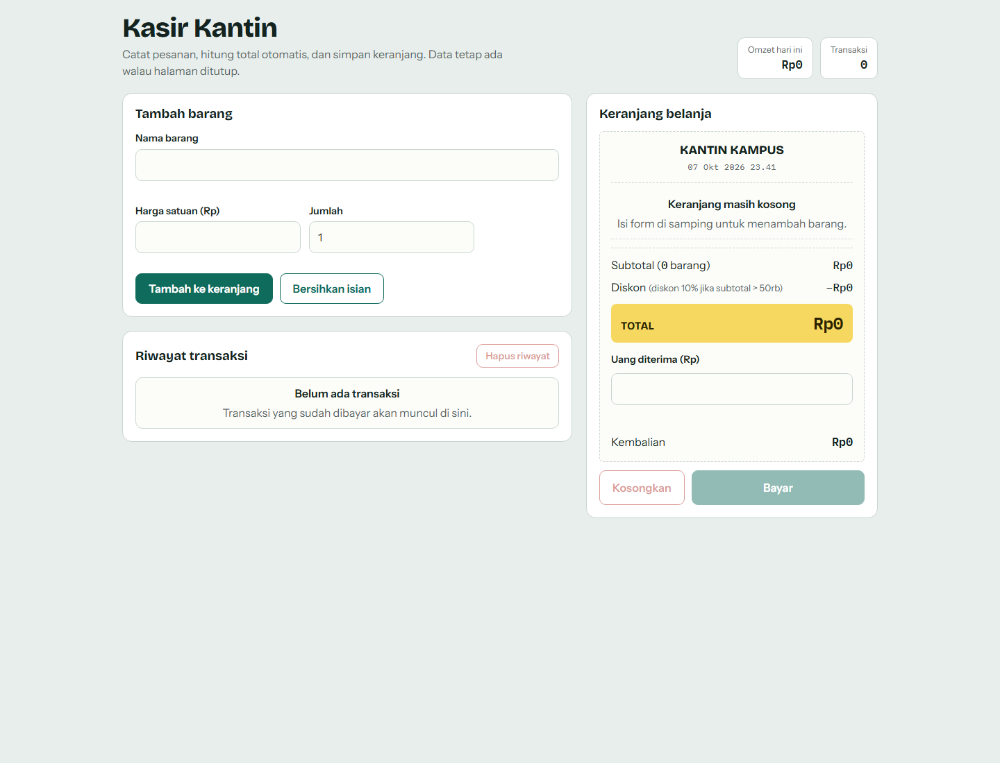
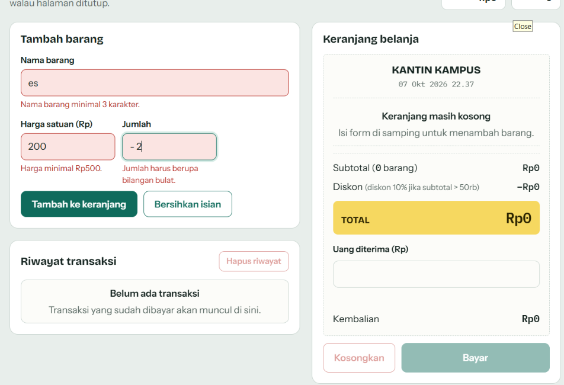
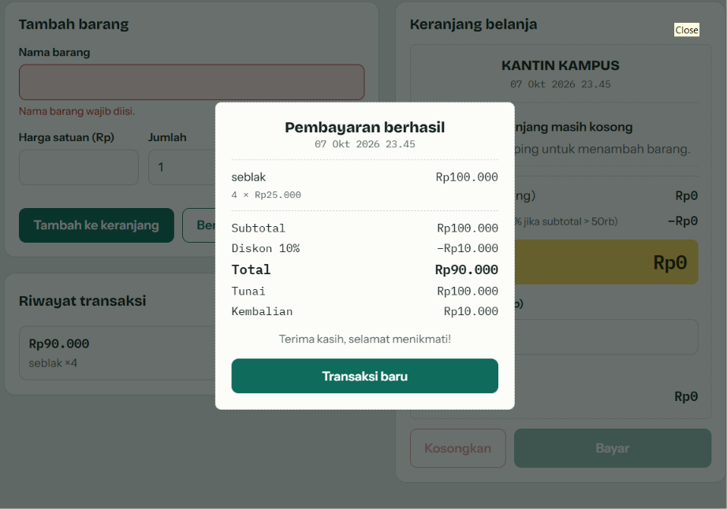

## Identitas

- **Nama Lengkap**: Nafisya Ghalia
- **NIM**: 124140100
- **Kelas Praktikum**: RB

---

## Deskripsi Aplikasi

**Kasir Kantin** adalah aplikasi Point of Sale (POS) sederhana berbasis web yang dirancang untuk membantu transaksi operasional kantin secara efisien. 

- **Tujuan Pembuatan**: Mengotomatisasi proses perhitungan total belanja, penerapan diskon, perhitungan kembalian, serta menyimpan riwayat transaksi secara persisten tanpa bergantung pada database eksternal.
- **Studi Kasus**: Sistem Kasir Kantin Sekolah/Kampus yang membutuhkan pencatatan barang belanjaan cepat, validasi input yang ketat untuk mencegah kesalahan entri kasir, serta laporan transaksi harian sederhana.

---

## Panduan Menjalankan Aplikasi

1. **Persiapan Berkas**: Pastikan file `index.html`, `style.css`, dan `script.js` berada dalam satu folder yang sama.
2. **Menjalankan via Live Server (Disarankan)**:
   - Buka folder proyek menggunakan **Visual Studio Code**.
   - Klik kanan pada file `index.html`.
   - Pilih **Open with Live Server**.
3. **Menjalankan Langsung**:
   - Buka File Explorer di komputer Anda.
   - Klik ganda pada file `index.html` untuk memuatnya langsung di browser (Google Chrome, Firefox, atau Edge).

---

## Daftar Fitur

- [x] **Validasi Form Input**
  - Nama barang wajib diisi (minimal 3 karakter, maksimal 40 karakter).
  - Harga satuan wajib angka positif (minimal Rp 500).
  - Jumlah/Qty wajib berupa bilangan bulat positif (minimal 1).
  - Pesan peringatan kesalahan (*error feedback*) muncul langsung di bawah bidang input yang salah.
- [x] **Kalkulator & Perhitungan Otomatis**
  - Kalkulasi subtotal per barang ($Harga \times Qty$).
  - Akumulasi total belanja seluruh item di keranjang.
  - Diskon otomatis 10% jika total belanja mencapai minimal Rp 50.000.
  - Kalkulator uang bayar dan kembalian otomatis.
  - Peringatan teks berwarna merah jika nominal pembayaran kurang.
- [x] **Manajemen Keranjang & LocalStorage**
  - Tabel daftar belanja interaktif dengan tombol hapus item per baris.
  - Tombol reset keranjang belanja dengan konfirmasi ganda.
  - Penyimpanan data keranjang dan riwayat transaksi secara persisten menggunakan `localStorage`.

---

## Tangkapan Layar (Screenshot)

1. **Tampilan Form Input Utama & Keranjang Belanja**  
   

2. **Tampilan Pesan Peringatan (Error Handling)**  
   

3. **Tampilan Hasil Perhitungan Kalkulator & Riwayat Transaksi**  
   

---

## ⚙️ Penjelasan Teknis Singkat

### 1. Penanganan Validasi Input
Validasi dilakukan secara reaktif menggunakan objek `validators` yang berisi aturan uji untuk setiap bidang input (`nama`, `harga`, `qty`). Saat pengguna mengetik atau keluar dari bidang input (*blur/input event*), fungsi `showError()` mengevaluasi keabsahan data. Jika tidak valid, elemen input diberi kelas `.invalid` dan pesan teks merah ditampilkan di bawahnya. Proses penambahan ke keranjang dikunci hingga seluruh input memenuhi syarat.

### 2. Algoritma Kalkulator Keuangan
Perhitungan dikelola oleh fungsi `calc()` dan `cashState()`:
- **Subtotal & Total**: Menggunakan metode `.reduce()` untuk menjumlahkan perkalian harga dan kuantitas seluruh objek di dalam *array* keranjang.
- **Diskon Otomatis**: Mengecek kondisi `subtotal >= 50000`. Jika bernilai benar (*true*), diskon ditetapkan sebesar 10% dari subtotal.
- **Kembalian**: Fungsi `cashState()` mengurangi nilai nominal uang bayar dengan total akhir. Jika hasilnya negatif, sistem menandai bahwa pembayaran masih kurang.

### 3. Mekanisme Serialisasi LocalStorage
Penyimpanan persisten memanfaatkan API `localStorage` browser:
- **Penyimpanan (`save`)**: Data *array* JavaScript diubah menjadi teks JSON menggunakan `JSON.stringify(data)` sebelum disimpan ke `localStorage`.
- **Pembacaan (`load`)**: Saat aplikasi dibuka kembali, data teks JSON diambil dari `localStorage` lalu diubah kembali menjadi *array* objek JavaScript menggunakan `JSON.parse(data)`. Penanganan kegagalan (*try-catch*) diterapkan untuk mencegah aplikasi rusak jika data lokal korup.